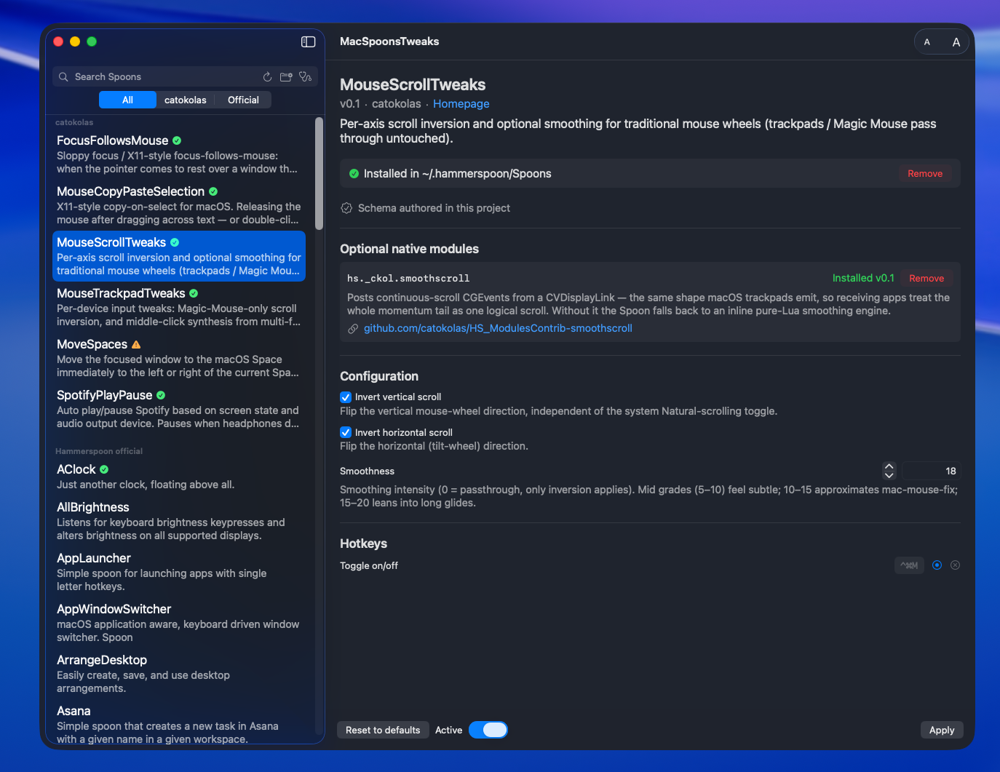

# MacSpoonsTweaks

[](https://github.com/catokolas/MacSpoonsTweaks/releases/latest)
[](https://github.com/catokolas/MacSpoonsTweaks/releases)
[](https://www.apple.com/macos/)
[](LICENSE)

A small SwiftUI companion for [Hammerspoon](https://www.hammerspoon.org).
Browse, install, and configure
[Spoons](https://www.hammerspoon.org/Spoons/) — Hammerspoon's plugin
format — through typed forms and a menu bar shortcut, without
hand-editing `~/.hammerspoon/init.lua`.



Pairs naturally with
[`catokolas/HS_SpoonsContrib`](https://github.com/catokolas/HS_SpoonsContrib)
(curated Spoons + optional native helpers) and the official
[`Hammerspoon/Spoons`](https://github.com/Hammerspoon/Spoons) catalog.

## Requirements

- **macOS 14** (Sonoma) or newer
- **Hammerspoon** installed:

  ```sh
  brew install --cask hammerspoon
  ```

  (Or download the `.app` from
  [hammerspoon.org](https://www.hammerspoon.org).) Launch it once so it
  registers itself.

That's it. MacSpoonsTweaks drives Hammerspoon through its bundled `hs`
command-line tool, which Homebrew symlinks automatically. If you
installed Hammerspoon by dragging the `.app` and the app can't reach
it, open the Hammerspoon console and run `hs.ipc.cliInstall()` once.

## Install

### Homebrew

A Homebrew cask is in preparation. Once published:

```sh
brew install --cask catokolas/tap/macspoonstweaks
```

### Download the latest release

Grab `MacSpoonsTweaks-x.y.z.zip` from
[Releases](https://github.com/catokolas/MacSpoonsTweaks/releases), unzip
it, and drag `MacSpoonsTweaks.app` into `/Applications`. See
[First launch](#first-launch) below — the build is ad-hoc signed, so
Gatekeeper needs a one-time allow.

### Build from source

If you have Xcode 16+:

```sh
git clone https://github.com/catokolas/MacSpoonsTweaks.git
cd MacSpoonsTweaks
./tools/build-app.sh
open build/MacSpoonsTweaks.app
```

## First launch

The app is ad-hoc signed (no paid Apple Developer ID), so macOS shows
a Gatekeeper warning the first time you open it. The exact dialog
depends on which macOS you're on — same outcome, different number of
clicks.

### macOS Sonoma (14) or earlier

1. Double-click → *"Cannot be opened because it is from an
   unidentified developer."* Close the dialog.
2. **Right-click → Open** (or two-finger click → Open). The same
   dialog reappears, this time with an **Open** button.
3. Click **Open**. macOS remembers; future launches just work.

### macOS Sequoia (15) and Tahoe (26+)

Apple removed the right-click shortcut on these versions. You have to
allow the app from System Settings:

1. Double-click → *"MacSpoonsTweaks Not Opened — Apple could not
   verify…"* Click **Done** (not *Move to Trash* — that deletes it).
2. **System Settings → Privacy & Security**, scroll to the bottom:
   *"MacSpoonsTweaks was blocked from use…"*. Click **Open Anyway**
   and authenticate with Touch ID / password.
3. Double-click the app again. The dialog now has an **Open**
   button — click it. macOS remembers from then on.

### Faster: one Terminal command

Works on every macOS version. Strips the quarantine attribute that
triggers the warning:

```sh
sudo xattr -dr com.apple.quarantine /Applications/MacSpoonsTweaks.app
open /Applications/MacSpoonsTweaks.app
```

See [DEVELOPERS.md](DEVELOPERS.md) for the full developer setup.

## First run

1. Launch MacSpoonsTweaks. Look for the puzzle-piece icon in the menu
   bar.
2. The sidebar lists every Spoon in the two catalogs (catokolas + the
   official Hammerspoon collection). Pick one.
3. Click **Install**. The app fetches the Spoon and asks you (via a
   banner) to patch your `init.lua` so it loads the generated snippet.
4. Edit the typed config form to taste, set hotkeys with the recorder,
   and click **Apply**. State is saved, the snippet at
   `~/.hammerspoon/mac_spoons_tweaks.lua` is regenerated, and the
   change is pushed live to the running Hammerspoon.
5. From the menu bar's *Active Spoons ▶* submenu you can activate /
   deactivate any installed Spoon without opening the window.

## License

MIT.
